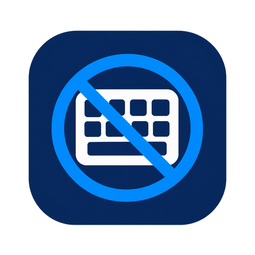

<p align="center">
  
</p>

<h1 align="center">Hotkey Blocker</h1>

<p align="center">一个 Windows 全局快捷键拦截工具，用于阻止指定应用注册全局快捷键。</p>

<p align="center">
  <a href="https://github.com/halifox/hotkey_blocker/actions/workflows/ci.yml"></a>
  
  
  
  <a href="LICENSE"></a>
</p>

<p align="center">
  <a href="#安装">安装</a> ·
  <a href="#功能">功能</a> ·
  <a href="#支持范围与限制">支持边界</a> ·
  <a href="#从源码构建">从源码构建</a> ·
  <a href="#工作原理">工作原理</a> ·
  <a href="#常见问题">常见问题</a>
</p>

> [!WARNING]
> **安全软件误报提醒**
>
> 本项目会向目标进程加载本地 DLL，并在目标进程中 Hook `RegisterHotKey`。这类行为与部分恶意软件的行为特征相似，杀毒软件、Windows Defender 或 SmartScreen 可能将程序或 Hook DLL 报告为风险程序。
>
> 只从可信来源获取构建产物。确认来源和行为后，再按需配置安全软件例外；不要为来源不明的程序直接添加信任，也不要用降低系统安全策略的方式解决注入失败。

## 功能概览

* 按 EXE 或文件夹建立规则，文件夹支持递归匹配其中的应用；
* 支持拦截全部、黑名单和白名单三种快捷键策略；
* 支持 Ctrl、Alt、Shift、Win 组合键，每个策略最多保存 128 个快捷键；
* 自动识别目标进程 x86 / x64 架构并加载对应 Hook 组件；
* 实时监控目标进程，显示等待启动、拦截生效、需要重启、启用失败等状态；
* 修改快捷键策略后需重启目标应用，已注册的快捷键不会被主动撤销；
* 支持系统托盘运行和当前用户登录时启动，不安装 Windows 服务；
* 使用原生 Win32/WTL 界面，显示应用图标、路径、策略和运行状态；
* 主窗口标题栏显示构建版本，启动时后台检查 GitHub Release，也可从帮助菜单或托盘菜单手动检查更新；
* 配置保存为本地 UTF-8 INI 文件，并记录进程监控、注入和错误日志；
* 所有规则和日志均保存在本地。

## 支持范围与限制

| 场景 | 支持情况 |
| --- | --- |
| Windows 10 / Windows 11 | 支持 |
| x86 / x64 目标进程 | 支持 |
| ARM64 专用 Hook | 当前未提供 |
| 标准 `RegisterHotKey` | 支持 |
| 按应用配置全部、黑名单和白名单策略 | 支持 |
| 低级键盘钩子、键盘驱动、自定义窗口消息快捷键 | 不保证支持 |
| 目标进程已在规则生效前运行 | 需要重启目标应用 |
| 目标进程以更高权限运行 | 可能无法打开或注入，不会绕过权限边界 |
| 受保护进程、反注入策略、动态代码限制 | 可能被系统或目标程序拒绝 |

启用或停用规则只影响后续注入以及之后启动的目标进程。已经加载 Hook 的进程不会被强制卸载 DLL，因此停用后通常仍需要重启目标应用才能完全恢复。

快捷键策略变更会标记已经运行的目标进程为需要重启。程序只拦截策略生效后发生的标准 `RegisterHotKey` 注册，不能事后撤销目标应用已经成功注册的快捷键。

## 安装

### 从发布版本安装

从 [GitHub Releases](https://github.com/halifox/hotkey_blocker/releases/latest) 下载安装包。x64 安装包包含主程序、x64 Hook，以及处理 32 位目标进程所需的 x86 Hook 和注入辅助程序。

安装并启动后：

1. 点击“添加 EXE”选择要限制的应用，或点击“添加文件夹”。
2. 确认规则处于启用状态。
3. 选中规则后点击“配置”，选择拦截全部、黑名单或白名单策略，并按需添加快捷键。
4. 如果目标应用已经运行，请完全退出并重新启动它。
5. 当状态显示“拦截已生效”后，该进程后续的标准全局快捷键注册会按当前策略处理。

主窗口标题栏显示当前构建版本。程序启动后会在后台检查 GitHub Release 的最新稳定版本；也可以从主窗口“帮助”菜单或系统托盘菜单选择“检查更新”。检查只请求公开的 Release 元数据，不会上传本地规则、配置或日志；程序不会静默下载或安装更新，只会在发现新版本时提供发布页面。

## 从源码构建

### 构建环境

- Windows 10/11
- Visual Studio 的 Desktop development with C++ 工作负载
- MSVC x86/x64 编译工具、Windows SDK 和 ATL
- CMake 3.25 或更高版本
- Ninja
- vcpkg（设置 `VCPKG_ROOT` 环境变量）

### 命令行构建

从 Visual Studio Developer PowerShell 的仓库根目录运行下面这条命令，即可从干净状态构建并打包完整的 x64 安装程序：

```powershell
cmake -DVCPKG_ROOT=C:/dev/vcpkg -DHKB_PROJECT_VERSION="1.0.0" -P cmake/package-x64.cmake
```

把 `C:/dev/vcpkg` 换成本机 vcpkg 根目录。该命令会构建 x86 Hook DLL 和注入辅助程序、x64 主程序和 Hook DLL，然后生成包含这些文件的 x64 NSIS 安装包及 SHA-256 文件。单架构日常构建仍可使用 `x86-release`、`x86-debug`、`x64-release` 和 `x64-debug` CMake presets。

完整步骤和依赖要求见 [构建、测试和打包](docs/BUILD.md)。

构建测试：

```powershell
ctest --test-dir out/build/x64-release-vcpkg --output-on-failure
```

主要产物：

| 路径 | 内容 |
| --- | --- |
| `out/build/<preset>-vcpkg/` | CMake/Ninja 中间文件和 vcpkg 依赖 |
| `out/bin/x64-release/` | x64 主程序和 Hook DLL |
| `out/bin/x86-release/` | x86 主程序、Hook DLL 和注入辅助程序 |
| `out/packages/` | NSIS 安装包及 SHA-256 校验文件 |

完整的构建、测试、打包和 CI 说明见 [构建、测试和打包](docs/BUILD.md)。
首次配置会通过 vcpkg 获取并静态构建 CPR 和 nlohmann/json 及其依赖。

## 运行

源码构建完成后，可以直接运行主程序：

```powershell
.\out\bin\x64-release\HotkeyBlocker.exe
```

程序启动后会显示主窗口并创建托盘图标。关闭主窗口只会将其隐藏；需要结束进程时，请使用托盘菜单中的“退出”。登录时启动会以后台模式启动程序。

## 工作原理

```text
                         HotkeyBlocker.exe
                    ┌────────────┼────────────┐
                    │            │            │
             RuleManager   ProcessMonitor   Tray / UI
             ConfigStore   BlockerService   StartupManager
                    │            │
                    └──────┬─────┘
                           ▼
                    HotkeyPolicyRegistry
                           │
                    按 PID 发布快捷键策略
                           │
                    ArchitectureDetector
                           │
             ┌─────────────┴─────────────┐
             │                           │
       x64 target process           x86 target process
             │                           │
      HotkeyHook64.dll       HotkeyBlockerInjector32.exe
                                         │
                                  HotkeyHook32.dll
             └─────────────┬─────────────┘
                           ▼
             Hook user32!RegisterHotKey
                           │
                           ▼
                 按应用策略返回成功或失败
```

工作流程：

- `ProcessMonitor` 发现匹配规则的目标进程，并记录 PID、架构和处理状态。
- `BlockerService` 根据目标进程匹配到的应用规则发布对应快捷键策略。
- `Injector` 根据目标进程架构选择 `HotkeyHook64.dll` 或 `HotkeyHook32.dll`；x64 主程序处理 32 位目标时使用 x86 注入辅助程序。
- Hook DLL 使用 Detours 拦截目标进程内部的 `user32!RegisterHotKey`，根据该进程的策略决定拒绝或调用原始 API。
- 规则、进程状态和错误信息通过主窗口及本地日志反馈给用户。

## 隐私与安全

- 配置和日志保存在本机当前用户目录，不需要云端账户。
- 日志可能包含目标程序路径、PID 和错误码。提交 Issue 或安全报告前，请脱敏用户名、项目路径和其他本地信息。
- 程序只针对规则匹配的目标进程执行本地 DLL 注入，不会绕过 Windows 权限边界。
- 快捷键策略通过本地进程级共享内存传递给对应 Hook DLL，不包含凭据或网络数据。
- 本项目不保证能够处理低级键盘钩子、驱动或目标程序自定义的快捷键实现。
- 详细安全说明见 [SECURITY.md](SECURITY.md)。

## 常见问题

### 为什么规则显示“重启程序后生效”？

目标进程在规则启用或快捷键策略修改前已经运行。程序不会强制卸载目标进程中的 DLL，也不会撤销目标应用已注册的快捷键，因此请完全退出并重新启动该应用。

### 黑名单和白名单有什么区别？

黑名单只拒绝列出的快捷键，其他快捷键放行；白名单只允许列出的快捷键，其他快捷键拒绝。黑名单为空表示放行全部，白名单为空表示拦截全部。

### 为什么目标程序仍然可以使用快捷键？

确认规则已启用，并重启目标应用。如果仍然有效，目标程序可能没有使用标准 `RegisterHotKey`，而是使用低级键盘钩子、驱动或自定义实现；也可能受权限、反注入策略或安全软件限制影响。

### 为什么显示“启用拦截失败”？

先查看 `%LOCALAPPDATA%\HotkeyBlocker\logs\hkb.log`，检查目标进程架构、权限、Hook DLL、快捷键策略共享内存和 x86 辅助程序是否完整。不要通过关闭系统保护或降低权限边界来解决问题。

### x64 安装包为什么还需要 x86 组件？

64 位主程序不能直接把 64 位 DLL 注入 32 位目标进程，因此 x64 安装包同时携带 x86 Hook DLL 和 `HotkeyBlockerInjector32.exe`。

### 如何清空配置并重新开始？

退出程序，备份后删除 `%LOCALAPPDATA%\HotkeyBlocker\config.ini`，再次启动时会创建空配置。已经运行的目标进程仍需要重启。

## 参与贡献

欢迎提交 Issue 和 Pull Request。提交修改前请阅读 [贡献指南](CONTRIBUTING.md)，并至少完成一次目标架构的 Release 构建和测试：

```powershell
cmake --preset x64-release
cmake --build --preset x64-release --parallel
ctest --test-dir out/build/x64-release-vcpkg --output-on-failure
```

涉及 Hook、注入、权限或安全边界的修改，请同时更新 [用户指南](docs/USER_GUIDE.md)、[安全说明](SECURITY.md) 或 [构建说明](docs/BUILD.md) 中对应的行为描述。

## 许可证

Hotkey Blocker 自有代码以 [MIT License](LICENSE) 发布。WTL、Detours 等第三方依赖的许可证和版权声明见 [THIRD_PARTY_NOTICES.md](THIRD_PARTY_NOTICES.md)。
